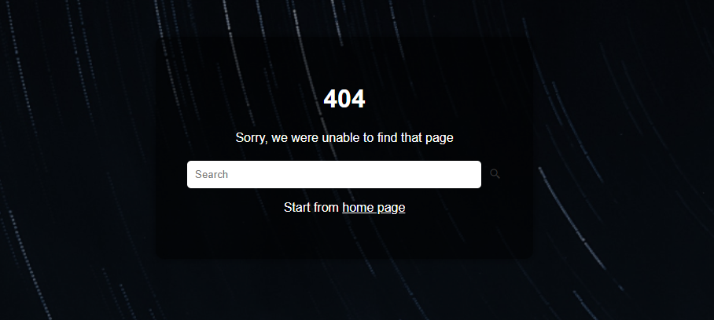

 

## 🖥️ Projeto

Esse é um projeto Web desenvolvido em Html e Css.

### 🔎 Tecnologias

Esse projeto foi desenvolvido com as seguintes tecnologias:

- HTML
- CSS
- Github

## 🎨 Layout

Você pode visualizar o layout do projeto através
[desse link][(https://www.figma.com/file/TJ2x4dIfYnyPk4t03yINIE/Projeto-02?](https://www.figma.com/design/CuxDAq2uBrF8UEdiLd49cL/Minimal-404-Page-Templates-(Community)?node-id=15-52&t=Y8yfpvPlCnbiLovm-0).
É necessario ter uma conta no [Figma](https://www.figma.com).

